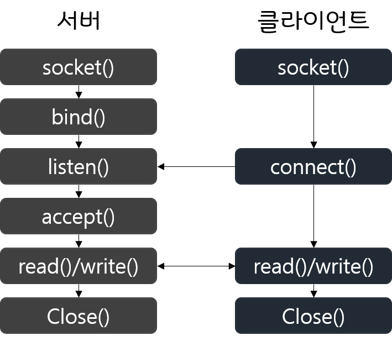

# 프로세스 간 통신

프로세스가 다른 프로세스와 **데이터를 주고 받는 것.** 데이터를 주고 받는 것이 목적.

- 프로세스 내부 데이터 통신 : 하나의 프로세스의 2개 이상의 스레드가 전역 변수나 파일을 이용해 데이터를 주고 받는 것
- 프로세스 간 데이터 통신 : 서로 다른 프로세스 간에 공용 파일, 파이프를 통해 통신하는 것
- 네트워크를 이용한 데이터 통신 : 여러 컴퓨터가 네트워크로 연결될 때, 소켓. 이는 **네트워킹**


### 프로세스 간 통신의 분류

#### 통신 방향에 따른 분류

전이중(소켓), 반이중(무전기..), 단방향(전역변수(공유 메모리라 생각하자), 파이프)

#### 통신 방식에 따른 분류

- 대기가 있는 통신(소켓, 파이프) : 동기화 지원
-  대기가 없는 통신(파일, 전역 변수) : 동기화 미지원. 받는 쪽이 busy waiting하며 계속 감시 해야..


### 프로세스 간 통신의 종류

가장 중요한 것은 **프로세스 동기화**.

#### 전역 변수를 이용한 통신

부모 프로세스에서 전역 변수를 생성하고 fork()를 통해 자식 프로세스를 만들어 통신하는 것. 이게 가능하다고? 공유 메모리로 확장하기 위한 설명인 것인가. 핵심은, 데이터를 수신하기 위한 busy wait.

#### 파일을 이용한 통신

open(), read()/write(), close()

절차

1. 프로세스가 입출력 프로세스에 읽기/쓰기를 요청한다. 

2. 입출력 프로세스는 하드디스크로부터 읽기/쓰기를 수행한다.

운영체제 입장에서 보면 **저장장치의 데이터를 읽고 쓰는 것**도 **일반 프로세스와 입출력 프로세스 간의 통신**이다. 또, fork를 통해 생성한 자식 프로세스와 파일을 통해서 통신이 가능한데, 아래와 같은 흐름이다.

```c++
#include <stdio.h>
#include <unistd.h>
#include <fcntl.h>

int main() {
    int pid, fd;
    char buf[5];
    
    fd = open("uri", O_RDWR);
    pid = fork();
    if (pid < 0 || fd < 0) exit(-1);
    else if (pid == 0) {
        write(fd, "Test", 5);
        close(fd);
        exit(0);
    }
    else {
        wait(0);
        lseek(fd, 0, SEEK_SET);
        read(fd, buf, 5);
        printf("%s", buf);
        close(fd);
        exit(0);
    }
}
```

부모 프로세스의 메모리 공간을 복사하기 때문에, fd로 열려 있는 파일도 복사될 것. close가 부모/자식 하나씩 있다. **파일 기술자가 복사되었다는 것은 파일을 읽고 쓸 권한만 복사되었다**는 의미. **파일 기술자의 위치 정보는 부모 프로세스와 자식 프로세스가 공유**. 그래서 lseek() 사용. wait을 통해 동기화.

#### 파이프를 이용한 통신

단방향, 동기화. 양방향을 위해 2개의 파이프를 쓴다. 만약 read한 파이프에 write한 데이터가 없다면 대기. 연결된 프로세스가 write하면 바로 대기 해제!

- annonymouse pipe : 일반적. 부모-자식 간, 같은 부모의 자식-자식 간
- named pipe : FIFO(특수한 파일)를 써 서로 관련 없는 프로세스 간 통신

```c
#include <stdio.h>
#include <unistd.h>

void main() {
    int pid, fd[2];
    char buf[5];
    
    if (pipe(fd) == -1) exit(-1);
    pid = fork();
    
    if (pid < 0) exit(-1);
	else if (pid == 0) {
        close(fd[0]);
        write(fd[1], "Test", 5);
        close(fd[1]);
        exit(0);
    }
    else {
        close(fd[1]);
        read(fd[0], buf, 5);
        close(fd[0]);
        printf("%s", buf);
        exit(0);
    }
}
```

파일을 open을 했던 것처럼 파이프는 pipe를 쓰고, 2개짜리 배열(읽기용, 쓰기용)을 인자로 넣어 준다. 파이프는 단방향 통신이므로, 필요 없는 파일 기술자는 닫는다. 우리말 읽기/쓰기 느낌처럼 fd[0]는 읽기용, fd[1]은 쓰기용. 부모/자식 모두 마찬가지이고, 완전한 동기화로 읽기/쓰기를 하려면 파이프를 2개를 선언해주면 된다. 

#### 소켓을 이용한 통신

서로 다른 컴퓨터 간 소켓으로 연결.

1. 컴퓨터의 위치를 알아야 하고
2. 여러 프로세스 중 어떤 프로세스와 통신할지

이를 통해 서로의 소켓을 연결하는 작업을 **바인딩**이라 한다.

#### 소켓 통신 과정

 

클라이언트는 딱히 파이프와 달라보이지 않는다. 서버를 보자.

socket을 생성하고, **생성한 소켓을 bind()를 통해 특정 포트에 등록**한다. 각 컴퓨터는 IP로 구분. 한 컴퓨터 내에도 여러 프로세스가 존재하기 때문에 어떤 프로세스와 통신할지 구분해야 한다. 이 때 port 사용. 하나의 포트 번호에 소켓은 여러 개 생성될 수 있다. ex) 일반적으로 http로 웹 요청을 할 때의 포트번호가 80인데, 이 80으로 연결되는 클라이언트가 한 명일 수 없다. 여러 명! **bind()는 특정 포트에 새로운 소켓을 등록하겠다는 의미**이다. 

이후 listen()으로 클라이언트를 기다린다. connect()가 도착하길 기다리는데, **connect()가 동시에 여럿일 수 있다. 이를 위해 accept() 단계에서 하나를 골라준다.** 클라이언트가 **accept()가 되면 소켓 기술자를 생성(이 소켓 기술자를 통해 통신)**되고, read()/write()가 수행 된다. close()를 통해 생성된 소켓 기술자를 닫고, **다시 listen()을 통해 다음 클라이언트를 기다린다.(while로 구현)**


#### 정리하면

open-read/write-close 구조를 이루는 통신 과정은 동기화를 이룬다.(파일 자체는 동기화가 없지만, fork()하고 wait()으로 동기를 맞춰주는 과정으로 해결 가능)


## 공유 자원과 임계구역

### 공유 자원의 접근

공유 자원(shared resource)은 **여러 프로세스가 공동으로 이용하는 변수, 메모리, 파일 등**을 말한다.

공유 자원은 누가 언제 읽고 쓰냐에 따라 데이터가 달라지므로, 프로세스들 간 접근 순서를 정해야 한다.

ex) 예금 10만원 저장. 프로세스 A가 예금 확인. B가 예금 확인. 예금에 5만원 추가해 B가 예금 15만원으로 저장. 아까 A가 확인한 10만원에 10만원을 얹어 20만원으로 저장. 최종 예금은 25만원이 아닌 20만원.

위의 예처럼 공유 자원을 병행적으로 읽거나 쓰는 상황을 race condition이 발생했다!


### 임계구역

공유 자원 접근 순서에 따라 실행 결과가 달라지는 영역을 임계구역(critical section)이라 한다. 임계구역에서는 **프로세스들이 동시에 작업해서는 안 된다.** **전역 변수**를 쓸 때, **하드웨어 자원**을 쓸 때.


### 생산자-소비자 문제

input(buf), output(buf), 원형 버퍼와 버퍼의 상태를 확인하기 위한 변수 sum.

input에서는 sum += 1, output에서는 sum -= 1을 수행하는데, 서로 동시에 적용하면 ex) sum = 3일 때 input의 결과는 sum = 4, output의 결과 sum = 2가 되어 데이터가 서로 다른 값을 갖게 될 수가 있다.


### 임계구역 해결 조건

- **상호 배제(mutual exclusion)** : 한 프로세스가 임계구역에 들어가면 다른 프로세스는 임계구역에 들어갈 수 없다.

- 한정 대기(bounded waiting) : 어떤 프로세스도 무한 대기 하면 안 된다. 특정 프로세스가 임계구역에 진입하지 못하면 안 된다.
- 진행의 융통성(progress flexibility) : 한 프로세스가 다른 프로세스의 작업을 방해하면 안 된다.


## 임계구역 해결 방법

단순한 방법 : lock. 프로세스가 공유하는 변수는 공유 변수. 임계구역으로 보호되어야 할 부분은 임계구역!

#### 상호 배제(mutual exclusion) 문제

```c
while (lock == true);
lock = true; // 임계구역 잠그기
balance += 10; // 
lock = false; // 동기화
```

위는 불완전하다. 두 프로세스 p1, p2 모두 현재 while 밖이고, p1이 while을 지나고나서 타임 퀀텀이 끝나 문맥교환이 이뤄지고, p2가 다시 뚫고, p1이 다시 뚫으면? 뚫림. 또 이는 busy waiting에 걸린다.

#### 한정 대기(bounded waiting) 문제

```c
// p1

lock1 = true;
while (lock2 == true) {}
임계구역
lock1 = false;

// p2
lock2 = true;
while (lock1 == true) {}
임계구역
lock2 = false;
```

상호배제는 해결했지만 두 프로세스 모두 한정 대기에 빠질 수 있는 문제 발생.


#### 진행의 융통성(progress flexibility) 문제

```c
lock = 1;

// p1
while (lock == 2) {}
임계구역;
lock = 2;

// p2
while (lock == 1) {}
임계구역;
lock = 1;
```

상호 배제 문제와 한정 대기는 해결했지만, 진행의 융통성 문제 발생. 위의 소스는 프로세스가 서로 번갈아 실행될 수 밖에 없기 때문.


### 피터슨 알고리즘

```c
bool lock1, lock2;
int turn;

// p1
lock1 = true;
turn = 2;
while (lock2 == true && turn == 2) {}
임계구역;
lock1 = false;

// p2
lock2 = true;
turn = 1;
while (lock1 == true && turn == 1) {}
임계구역;
lock2 = false;
```

상대에게 양보한다.. turn은 lock에 의한 한정 대기가 걸릴 때를 위한 보험. turn에 먼저 접근했던 프로세스가 결국 먼저 임계구역에 돌입하게 된다.


### 데커 알고리즘

```c
매커니즘 이해 후 작성 필요!
```


### 세마포어

n은 자원의 개수.

```
Semaphore(n);

P(); // if (RS > 0)RS -= 1 else block()
임계구역;
V(); // RS += 1 wake_up()
```

이는 임계구역이 잠겼는지 점검하거나, 바쁜 대기를 하거나, 다른 프로세스에 동기화 메시지를 보낼 필요가 없다. block으로 잠기는 프로세스는 세마포어 큐로 들어가서, wake_up을 통해 풀리므로 동기화도 필요 없다.

#### 여담

- P와 V는 각각 try와 increment를 뜻하는 [네덜란드어](https://ko.wikipedia.org/wiki/네덜란드어) Proberen과 Verhogen의 머릿글자를 딴 것이다.)

- 세마포어라는 말은 기차에서 쓰는 까치발 신호기라고 한다.

### 모니터

세마포어의 단점은 사람이 구현할 경우의 실수(..)인데, 이를 위해서 모니터 탄생.

공유 자원을 내부적으로 숨기고 **공유 자원에 접근하기 위한 인터페이스만 제공함**으로써 **자원을 보호하고 프로세스 간에 동기화**를 시킨다. 시스템 호출과 같다고 생각하자.

1. 세마포어의 P(), V()를 사용하지 않고, 모니터에 직접 작업을 요청
2. 모니터는 요청받은 작업을 모니터 큐에 저장한 후 순서대로 처리, 결과만 리턴.

```java
monitor shared_balance {
    private:
    	int balance = 10;
    	boolean busy = false;
    	condition mon;
    
    public:
    	increase(int amount) {
            if (busy == true) mon.wait();
            busy = true;
            balance += amount;
            // 소스에는 없는데 이 자리에 busy = false;가 있어야 하는거 아닌가
            mon.signal();
        }
}
```

- 임계구역 보호와 상태 변화를 위해 내부 변수 condition mon을 두었다.

- wait()은 세마포어의 P()에 해당
- signal()은 세마포어의 V()에 해당


