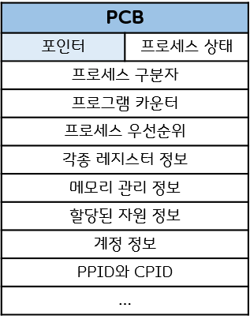
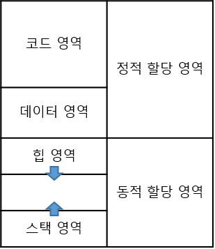

# 프로세스와 스레드

지금의 운영체제는 시분할 방식으로 프로세스를 수행한다.

프로세스는 컴퓨터 시스템의 작업 단위로 **태스크(Task)**라고도 부른다.

#### 프로세스 제어 블록(Process Control Block, PCB)

- PID(Process Identification)
- 메모리 관련 정보
- 각종 중간 값

**프로세스 = 프로그램 + PCB**

### 프로세스의 5(+2)가지 상태

- 생성 : 프로세스가 메모리에 올라와 실행 준비를 완료하 상태. PCB 생성
- 준비 : CPU를 얻기 위한 대기 상태.
- 실행 : CPU를 주어진 시간 동안 얻고 현재 처리 중인 상태.
- 대기 : 실행 상태에 있는 프로세스가 입출력을 요청하면 입출력이 완료될 때까지 대기.
- 완료 : 주어진 시간 동안 작업을 마치면 진입. PCB 폐기.

- 추가적인 상태
  - 휴식 : 프로세스가 작업을 일시적으로 쉬고 있는 상태. ctrl+z. 여전히 메모리에 존재하는 상태.
  - 보류 : 프로세스가 메모리에서 잠시 쫓겨난 상태. 메모리 밖의 스왑 영역(메모리에서 쫓겨난 데이터가 임시로 보관되는 곳)에 보관.
    - 메모리가 꽉 차서 일부 프로세스를 메모리 밖으로 내보낼 때
    - 프로그램 오류가 있어 실행을 미룰 때
    - 바이러스같은 프로세스라 판단될 때
    - 입출력을 기다리는 프로세스의 입출력이 계속 지연될 때

#### CPU 스케줄러

dispatch : 준비 상태에 있는 프로세스 중 다음에 실행할 프로세스를 선정하는 일

타임 퀀텀(타임 슬라이스) : 프로세스가 실행 상태일 수 있는 배당된 작업 시간.

타임 아웃 : 주어진 시간 동안 일을 다 끝내지 못하고 준비 상태로 돌아가는 것.(클록으로부터의 인터럽트)

## PCB와 문맥 교환

프로세스를 실행하는 데 필요한 중요한 정보를 보관하는 자료 구조로 Task Control Block이라고도 한다.

 

- 포인터 : 프로세스 제어 블록의 첫 번째 블록에 저장. 준비 상태나 대기 상태의 큐를 구현할 때 포인터를 사용. **다음에 실행될 프로세스의 포인터(포인터들로 큐를 구현)**를 갖는다.

- 프로세스 상태 : 생성, 준비, 실행, 대기, 보류 등.

- **프로세스 우선순위** : 프로세스별 우선순위를 담고 있다. 이는 스케줄링에서 처리됨.
- 메모리 관리 정보 : 프로세스가 메모리의 어디에 있는지 나타내는 메모리 위치 정보, 메모리 보호를 위해 사용하는 경계 레지스터 값과 한계 레지스터 값 등이 저장된다. 그 외에 세그멘테이션 테이블, 페이지 테이블 등 보관.

#### 포인터의 역할

부모 프로세스에 대한 포인터, 자식 프로세스에 대한 포인터, 프로세스가 위치한 메모리에 대한 포인터, 할당된 자원에 대한 포인터 등

대기 상태의 큐가 하나라면, 하드디스크로부터 인터럽트가 들어왔을 때, 해당하는 프로세스를 찾기 위해 대기 큐의 모든 프로세스를 찾는 건 불-편. **같은 입출력을 요구한 프로세스끼리 모아놓는다.** 즉, 포인터는 함께 모여 큐를 구성하는 프로세스들 간에, 다음에 색인할 프로세스의 주소를 갖는 것.

### 문맥 교환(context switching)

CPU가 차지하던 프로세스가 나가고 새로운 프로세스를 받아들이는 작업. 나가는 프로세스는 PCB에 내용을 저장하며 나가고, 들어오는 프로세스의 PCB에 있는 내용으로 CPU를 세팅한다.

문맥 교환이 일어나는 경우

- 타임아웃 될 때
- 인터럽트 걸릴 때

## 프로세스의 연산

### 프로세스의 구조

- 코드 영역 : 프로세스의 본문이 기술
- 데이터 영역 : 프로세스 수행에 필요한 데이터들. 포인터를 제외한 일반적인 변수는 선언할 때 그 크기가 결정된다. 따라서 코드 영역과 데이터 영역은 프로세스가 실행되기 직전에 위치와 크기가 결정되고 실행되는 동안 변하지 않으므로 **정적 할당 영역**이라고 부른다.
- 스택 영역 : 코드를 작동하기 위해 운영체제가 부수적으로 관리하는 데이터 영역.
  - 프로세스 내에서 함수 호출시 되돌아올 위치를 저장.
  - 함수 호출시 반환되어야 하는 지역변수 저장.
- 힙 영역 : 동적으로 할당되는 변수 영역. 프로세스의 메모리 관리를 위해 필수적.

 

### 프로세스의 생성과 복사

fork() 시스템 호출 : 실행 중인 시스템으로부터 새로운 프로세스를 복사. 실행 중인 프로세스와 똑같은 프로세스가 하나 더 만들어진다. 어떤 실행중인 프로세스를 복사해서 새로 만드는 게 프로그램을 새로 시작하는 것보다 빠르다. ex) 크롬에서 ctrl+N으로 페이지 복사. fork() 시스템 호출을 하면 프로세스 제어 블록을 포함한 부모 프로세스 영역의 대부분이 자식 프로세스에 복사되어 똑같은 프로세스가 만들어진다. 이 때 바뀌는 것은, PID, PPID, CPID.

#### 장점

- **프로세스의 생성 속도가 빠르다.** 하드디스크로부터 프로그램을 새로 가져온 것이 아니라, 메모리에 있는 프로세스를 복사한 것이기 때문에 더 빠르다.

- **추가 작업 없이 자원을 상속할 수 있다.**

- **시스템 관리를 효율적으로 할 수 있다.** 부모-자식이 PID-PPID-CPID로 연결돼 있어, 자식 프로세스가 종료될 때, 자식이 사용하는 자원을 부모 프로세스가 정리할 수 있다.

유닉스에서 fork()를 쓰려면 unistd.h 선언하면 된다.

### 프로세스의 전환

